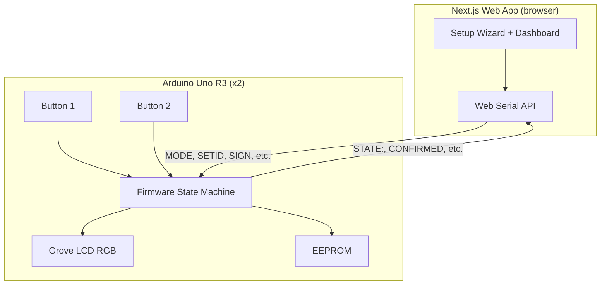
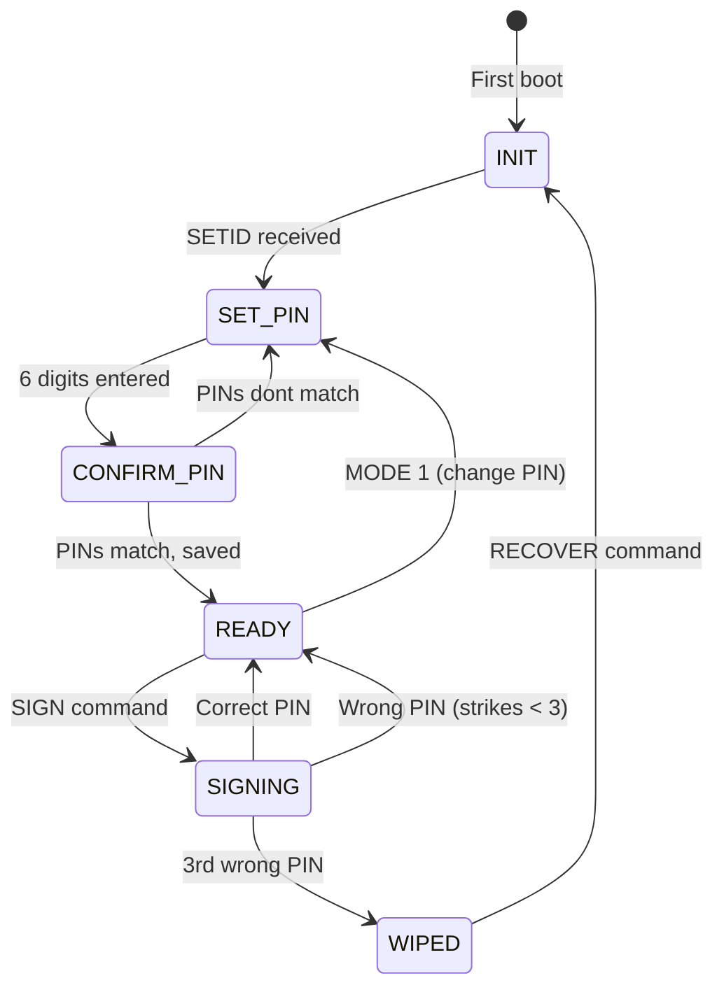

# Arduino Crypto Ledger Simulator

## Current State

- [ledger.ino](firmware/ledger/ledger.ino): No LCD, 1 button, no PIN. Handles SIGN/CANCEL/SETID/CHALLENGE/AUTH via serial. EEPROM stores stats + device ID (XOR-encrypted).
- [bridge.mjs](serial-bridge/bridge.mjs): Node/Express on port 3456. Opens two COM ports, proxies serial commands via HTTP. Has broken `/stats` route.
- [page.tsx](src/app/page.tsx): Next.js app with Web Serial. Two LedgerCards for balance/send/airdrop. Connects to Arduino for SIGN confirmation only.
- `HARDWARE_MODE` in `.env` is **never used** by any code.
- Ledger A/B "verification" is a UI warning toast, not enforced.

---

## Architecture

---

## Firmware Rewrite: `ledger.ino`

### State Machine Modes

| Mode | Name          | Trigger                                     | LCD Display                           | Behavior                                     |
| ---- | ------------- | ------------------------------------------- | ------------------------------------- | -------------------------------------------- |
| 0    | `INIT`        | First boot (no magic byte)                  | "cryptX Ledger" / "Awaiting Setup..." | Waits for `SETID A` or `SETID B` from serial |
| 1    | `SET_PIN`     | After registration, or `MODE 1` from serial | "Create PIN:" / progress dots         | 6-digit PIN entry via 2 buttons              |
| 2    | `CONFIRM_PIN` | After first PIN entry                       | "Confirm PIN:" / progress dots        | Re-enter PIN to confirm                      |
| 3    | `READY`       | After PIN confirmed, or `MODE 3`            | "Ledger A Ready" / balance info       | Normal idle, waits for SIGN commands         |
| 4    | `SIGNING`     | `SIGN` command received                     | "Sign TX?" / "Enter PIN:"             | Enter PIN to approve transaction             |
| 5    | `WIPED`       | 3 wrong PIN attempts                        | "DEVICE WIPED" / "Recover via app"    | All EEPROM cleared, needs full re-setup      |

### State Flow

### EEPROM Layout (expanded, all XOR-encrypted)

- `0x00` 1B - Device state (0=UNINIT, 1=REGISTERED, 2=PIN_SET)
- `0x01` 1B - Device ID ('A'-'Z')
- `0x02` 6B - PIN digits (each byte is 1 or 2, stored plaintext + XOR scramble -- simple, sufficient for demo)
- `0x08` 1B - PIN set flag (0xAA = set)
- `0x09` 1B - Failed PIN attempts (0-3)
- `0x0A` 2B - Total confirm count (uint16 LE)
- `0x0C` 2B - Total reject count (uint16 LE)
- `0x0E` 1B - Consecutive rejects streak
- `0x0F` 1B - Magic byte (0xCE)

### 2-Button PIN Input

- **Button 1 (pin 2)** = digit "1", **Button 2 (pin 3)** = digit "2"
- **Debounce**: 300ms lockout after each press. A held button only registers once.
- **Enter**: Both buttons pressed simultaneously (within 100ms window) = submit
- **LCD feedback**: Each digit shows as a filled dot. Example: `PIN: ●●●___` after 3 presses.
- After 6 digits, LCD shows "Press both = Enter" prompt.

### Updated Serial Protocol

New/changed commands (additions to existing protocol):

- `MODE <n>` -- switch to mode n (with state guards: can't enter READY if no PIN set)
- `RECOVER` -- from WIPED state, clears EEPROM and restarts at INIT
- `STATE` -- Arduino responds with `STATE:<mode>,<id>,<pin_set>,<fails>` (current status)
- Existing `SETID`, `SIGN`, `CANCEL`, `PING`, `CHALLENGE`, `AUTH`, `UNLOCK`, `RESET_STATS` remain

New unsolicited output from Arduino:

- `STATE:<mode_name>` emitted on every mode transition (so the web app stays in sync)
- `PIN_PROGRESS:<n>` emitted as each digit is entered (so web app can show progress)
- `PIN_OK` / `PIN_FAIL:<attempts_left>` after PIN submission
- `WIPED` when 3 strikes triggers a device wipe

### Hardware Setup

- Both boards get the **same** firmware. `DEFAULT_ID` in source becomes just a fallback -- the real ID is always set via `SETID` from the website during the setup wizard.
- Grove LCD: I2C on A4/A5 (standard Wire), `rgb_lcd.h` library
- Button 1: pin 2 with `INPUT_PULLUP`
- Button 2: pin 3 with `INPUT_PULLUP`

---

## Serial Bridge Updates: `bridge.mjs`

- Add `POST /mode` endpoint: `{ wallet, mode }` -- sends `MODE <n>` to the Arduino
- Add `POST /recover` endpoint: `{ wallet }` -- sends `RECOVER` to the Arduino
- Add `GET /state?wallet=A|B` endpoint: sends `STATE`, parses `STATE:` response
- Fix the broken `GET /stats` route (remove dead code, use only the authenticated path)
- Update `deviceMeta` to track current mode, PIN set status, and fail count from `STATE:` responses
- Parse new unsolicited lines: `STATE:`, `PIN_PROGRESS:`, `PIN_OK`, `PIN_FAIL:`, `WIPED`

---

## Web App Updates: `page.tsx`

### Setup Wizard Flow

Add a multi-step setup flow that appears when a ledger is in INIT or SET_PIN state:

1. **Step 1 - Connect**: User clicks "Connect Arduino" (existing Web Serial picker)
2. **Step 2 - Register**: Web app sends `SETID A` (or B). LCD confirms "Registered as Ledger A"
3. **Step 3 - Create PIN**: Web app sends `MODE 1`. LCD prompts PIN entry. Web app shows progress as `PIN_PROGRESS` events arrive. User physically presses buttons on the Arduino.
4. **Step 4 - Confirm PIN**: User re-enters PIN on Arduino. If mismatch, retry step 3.
5. **Step 5 - Ready**: PIN saved. Ledger enters READY mode. Dashboard shows normal view.

### Transaction Flow (with PIN)

When user clicks "Send" and hardware is connected:

1. Web app sends `SIGN` to Arduino via Web Serial
2. LCD shows "Sign TX? Enter PIN:"
3. User enters 6-digit PIN on Arduino buttons
4. If correct: `CONFIRMED` returned, transaction proceeds (existing Solana flow)
5. If wrong: `PIN_FAIL:2` (2 attempts left). User can retry.
6. If 3rd wrong: `WIPED` returned. Web app shows recovery modal.

### HARDWARE_MODE Toggle

- Rename `HARDWARE_MODE` to `NEXT_PUBLIC_HARDWARE_MODE` so the browser can read it
- When `true`: require Arduino connection + PIN entry before any transaction; show setup wizard if ledger not initialized
- When `false`: current software-only behavior (no Arduino needed, useful for dev/testing without hardware)
- Update both `.env` and `.env.example`

---

## `.env` Changes

- Rename `HARDWARE_MODE` to `NEXT_PUBLIC_HARDWARE_MODE` so the browser can read it
- Keep `BRIDGE_COM_A` / `BRIDGE_COM_B` as-is (bridge-only)
- Document the variable: controls whether the web app requires physical Arduino for transactions

---

## Verification: Ledger A vs B

The existing logic reads `DEVICE:([AB])` from the Arduino greeting and shows a warning toast if mismatched. This will be **strengthened**:

- On connect, web app sends `STATE` command to get full device status
- If device ID doesn't match the slot (e.g., device says 'B' but user connected to Ledger A slot), **block** the connection (not just warn)
- If device is in INIT state, the setup wizard handles registration (SETID) so the ID will always match
