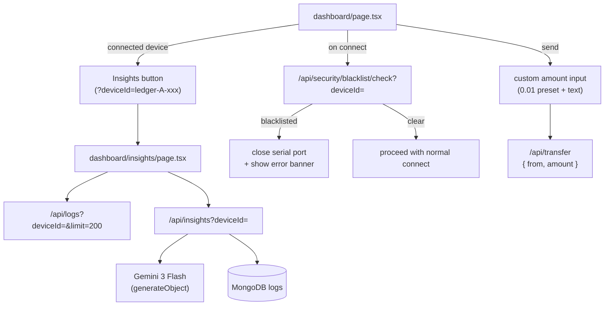

# Insights AI + Blacklist Enforcement + Custom Send Amount

## Architecture Overview



## 0. Logging Gap Fixes (prerequisite for accurate AI analysis)

Three events that are described as risky are not currently being written to MongoDB. These need to be patched in [`src/app/dashboard/page.tsx`](src/app/dashboard/page.tsx) before the insights analysis will have reliable signal.

**Gap 1 — Natural / unexpected disconnects**

The `readLoop` catch block currently swallows port-close errors silently. Fix: call `sendClientLedgerLog` with `DISCONNECT:FAIL` and include `during_signing: true` in metadata if `signExpiresAt` was still active at the moment. This is the primary signal for the "disconnects during transactions" risky pattern.

```ts
// in DeviceConnection.readLoop() catch block:
} catch {
  if (usbSession) {
    void sendClientLedgerLog({ deviceId, action: "DISCONNECT", status: "FAIL",
      metadata: { reason: "port_closed", during_signing: signActive } }, { usbConnected: false });
  }
}
```

**Gap 2 — PIN failures during signing**

`processSerialLine` receives `PIN_FAIL:X` from firmware but does not log it. Fix: when in SIGNING mode and `PIN_FAIL:X` is parsed, call `sendClientLedgerLog` with `AUTH_FAIL`. This gives real data to `countAuthFailsForDeviceSince` (which already exists in the repo but currently sees near-zero values from hardware clients).

```ts
} else if (line.startsWith("PIN_FAIL:") && currentMode === "SIGNING") {
  void sendClientLedgerLog({ deviceId, action: "AUTH_FAIL", status: "FAIL",
    metadata: { reason: "wrong_pin", attemptsLeft: parseInt(line.slice(9)) } }, { usbConnected: true });
}
```

**Gap 3 — Device wipe (outside signing) and seed recovery**

- When `WIPED` is received outside a signing flow (e.g. during setup), log `SIGN_TX:FAIL` with `reason: "device_wiped"`.
- When `confirmRecover` succeeds, log `CONNECT:SUCCESS` with `metadata.recovered: true`. This makes repeated seed resets visible to the LLM as a pattern over time.

## 1. Install Dependencies

```bash
pnpm add ai @ai-sdk/google
```

Add `GOOGLE_GENERATIVE_AI_API_KEY=` to [`.env.example`](.env.example).

## 2. Blacklist Check Endpoint

**New file:** `src/app/api/security/blacklist/check/route.ts`

- `GET ?deviceId=ledger-A-xxx`
- Calls `isBlacklisted(db, ip, deviceId)` from [`src/lib/security/blacklist.ts`](src/lib/security/blacklist.ts)
- Returns `{ blacklisted: boolean, reason?: string }`

## 3. Blacklist Enforcement in Dashboard

**Modify:** [`src/app/dashboard/page.tsx`](src/app/dashboard/page.tsx) — inside `connectHardware()`, after the device is identified (after `STATE` is parsed, before `setState connected: true`):

```ts
const check = await fetch(
  `/api/security/blacklist/check?deviceId=ledger-${ledger}-${stateDeviceId}`,
);
const { blacklisted, reason } = await check.json();
if (blacklisted) {
  await device.close(); // disconnect serial port → hardware goes idle
  toast.error(`Device blacklisted: ${reason ?? "contact support"}`);
  return;
}
```

Add a `blacklistedDevice` state (`{ ledger: "A" | "B"; reason: string } | null`) so when a blacklisted device is detected the port closes and a blocking modal appears.

**Blacklist modal** — full-screen overlay (same pattern as the seed backup / recovery modals, non-dismissible):

```tsx
{
  blacklistedDevice && (
    <div className="fixed inset-0 z-50 flex items-center justify-center p-4">
      <div className="bg-background/80 fixed inset-0 backdrop-blur-sm" />
      <div className="bg-popover ring-destructive/40 relative z-10 flex w-full max-w-md flex-col gap-4 rounded-xl p-6 shadow-lg ring-1">
        <div className="flex items-center gap-3">
          <ShieldAlert className="text-destructive size-6 shrink-0" />
          <h2 className="text-base font-semibold">Device Blocked</h2>
        </div>
        <p className="text-muted-foreground text-sm">
          Ledger {blacklistedDevice.ledger} ({blacklistedDevice.reason}) has
          been flagged and is no longer permitted to use this platform.
        </p>
        <div className="bg-muted space-y-1 rounded-lg p-4 text-sm">
          <p className="font-medium">Contact Support</p>
          <p className="text-muted-foreground">Email: support@cryptx.dev</p>
          <p className="text-muted-foreground">Discord: discord.gg/cryptx</p>
          <p className="text-muted-foreground">
            Reference ID: {blacklistedDevice.ledger}-blocked
          </p>
        </div>
        <a
          href="/auth/logout"
          className={buttonVariants({ variant: "outline" })}
        >
          <LogOut className="mr-2 size-3.5" /> Log out
        </a>
      </div>
    </div>
  );
}
```

The modal is non-dismissible (no close button). The only exit is the logout link. The `LedgerCard` itself still shows the blacklisted device's slot grayed out with a "Blocked" badge, but no actions are available.

## 4. Custom Amount Send

**Modify** `LedgerCard` in [`src/app/dashboard/page.tsx`](src/app/dashboard/page.tsx):

- Add `sendAmount: string`, `setSendAmount` props (controlled from `HomePage`)
- Add `<Input>` field + a `0.01` quick-fill `<Button>` below it
- Validate: `parseFloat(sendAmount) > 0` and `parseFloat(sendAmount) <= wallet.balance`
- Show inline error if over balance
- Pass validated amount up to `onSend(amount: number)`

**Modify `handleTransfer`** to accept `amount: number` and pass it:

- To the `SIGN_TX` log metadata (already goes to server in `metadata.amount`)
- To `fetch("/api/transfer", { body: JSON.stringify({ from, amount }) })`

The transfer API already accepts dynamic amounts via Zod (`z.number().positive().max(10)`), so no API changes needed there.

## 5. Insights API Route

**New file:** `src/app/api/insights/route.ts`

- `GET ?deviceId=ledger-A-xxx`
- Validates `deviceId` starts with `ledger-`
- Fetches up to 200 recent logs via `queryLogs(db, { deviceId, limit: 200 })`
- Formats logs as a compact JSON summary (timestamps, actions, statuses, key metadata fields)
- Calls Gemini via Vercel AI SDK `generateObject`:

```ts
import { google } from "@ai-sdk/google";
import { generateObject } from "ai";
import { z } from "zod";

const { object } = await generateObject({
  model: google("gemini-3-flash-preview"),
  schema: z.object({
    riskLevel: z.enum(["LOW", "MEDIUM", "HIGH"]),
    summary: z.string(),
    riskyBehaviors: z.array(
      z.object({
        label: z.string(),
        count: z.number(),
        severity: z.enum(["LOW", "MEDIUM", "HIGH"]),
        description: z.string(),
      }),
    ),
    normalBehaviors: z.array(
      z.object({
        label: z.string(),
        description: z.string(),
      }),
    ),
    recommendation: z.enum(["CLEAR", "MONITOR", "BLACKLIST"]),
  }),
  prompt: `...`, // structured prompt with log data + risky/unrisky examples
});
```

**Risky signals to prompt Gemini on:**

- Repeated `DISCONNECT` during `SIGN_TX` / `SEND_TX` sessions
- High `AUTH_FAIL` count (especially spikes)
- Multiple device wipes / seed resets (`WIPED` events or metadata `device_wiped`)
- `CONNECT` failures with `reason: wrong_ledger` (device A trying to register as B)
- Sudden spike in transaction volume
- Being in the blacklist collection

**Normal signals:**

- Low `AUTH_FAIL` ratio over total auth events
- Consistent connect/disconnect pattern
- No blacklist entries
- Successful transactions without prior failed signs

Returns: `{ analysis: { riskLevel, summary, riskyBehaviors, normalBehaviors, recommendation }, logCount }`

## 6. Insights Page

**New file:** `src/app/dashboard/insights/page.tsx` (client component)

- Reads `?deviceId` from `useSearchParams()`
- Guards: if no deviceId or not `ledger-` prefix → redirect to dashboard
- Two parallel fetches on mount: logs (`/api/logs?deviceId=...&limit=200`) + AI analysis (`/api/insights?deviceId=...`)
- UI layout:
  - Header with device ID + back link to `/dashboard`
  - **AI Summary card** — risk level badge (color-coded), summary text, recommendation badge
  - **Risky Behaviors** section — list with severity badges + counts
  - **Normal Behaviors** section — checkmarks list
  - **Raw Log Table** — timestamp, action, status, metadata preview (collapsible rows), same style as existing transaction history table

## 7. Insights Navigation from Dashboard

**Modify `LedgerCard`** — add an "Insights" icon button in the card footer (only shown when `hwState.connected`):

```tsx
import { BarChart2 } from "lucide-react";
// ...
<Button variant="ghost" size="sm" asChild>
  <a href={`/dashboard/insights?deviceId=ledger-${index}-${hwState.deviceId}`}>
    <BarChart2 className="size-3" /> Insights
  </a>
</Button>;
```

## Files Summary

- **New:** `src/app/dashboard/insights/page.tsx`
- **New:** `src/app/api/insights/route.ts`
- **New:** `src/app/api/security/blacklist/check/route.ts`
- **Modified:** `src/app/dashboard/page.tsx` (logging gaps, blacklist check, custom amount, insights link)
- **Modified:** `.env.example` (add `GOOGLE_GENERATIVE_AI_API_KEY`)

## Signal Coverage After Patches

| Risky Scenario                  | Covered?        | How                                                    |
| ------------------------------- | --------------- | ------------------------------------------------------ |
| Disconnects during transactions | After gap fix   | `DISCONNECT:FAIL` + `during_signing: true`             |
| PIN failures / device wipes     | After gap fix   | `AUTH_FAIL` per wrong PIN; `SIGN_TX:FAIL device_wiped` |
| Seed resets / recovery          | After gap fix   | `CONNECT:SUCCESS recovered:true` on each recovery      |
| Device A connecting as B        | Already covered | `CONNECT:FAIL wrong_ledger` with slot mismatch         |
| Transaction spike               | Already covered | `SEND_TX` + `MALICIOUS_ACTIVITY txSpam`                |
| Low fails (unrisky)             | Already covered | Low `AUTH_FAIL` + `SIGN_TX:FAIL` counts                |
| Not blacklisted (unrisky)       | Already covered | Absence of blacklist entry                             |
