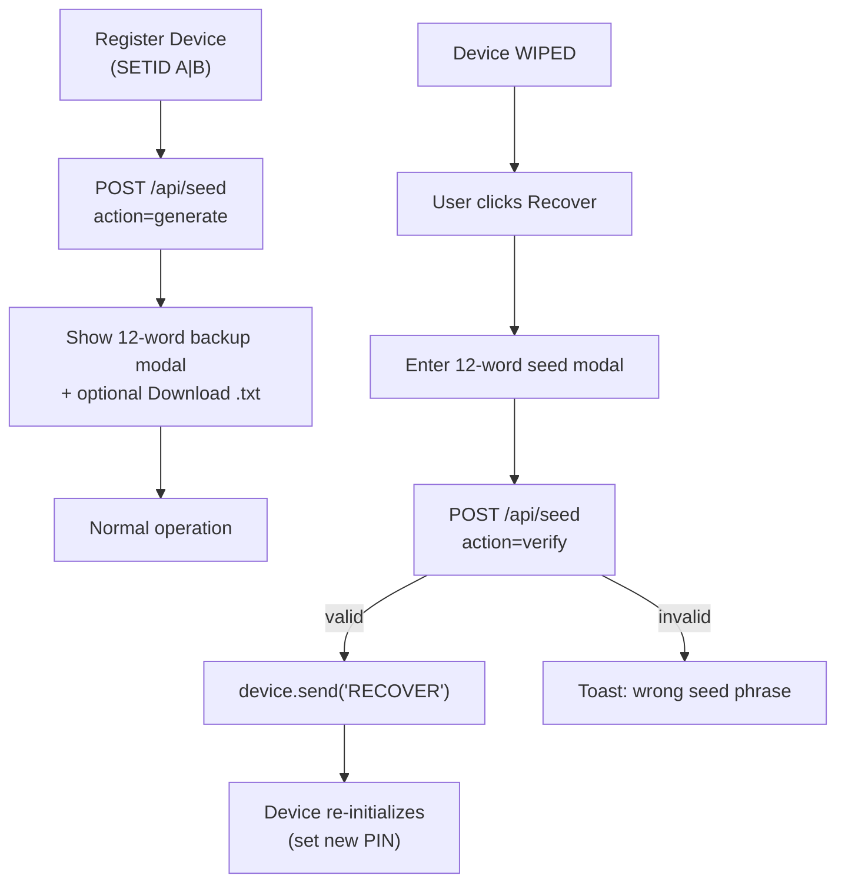

# Seed Phrase Gate Feature

## How it works



## Files to create

**`src/app/api/seed/route.ts`** — two actions on one endpoint:

- `generate`: calls `bip39.generateMnemonic()` (128-bit = 12 words), stores SHA-256 hash keyed by wallet (`A`/`B`) in `data/seeds.json`, returns `{ words: string[] }`
- `verify`: hashes the submitted phrase, compares against stored hash, returns `{ valid: boolean }`

**`data/seeds.json`** — server-side file (gitignored):

```json
{ "A": "<sha256-hash>", "B": "<sha256-hash>" }
```

## Files to modify

**[`src/app/page.tsx`](src/app/page.tsx)** — three changes:

1. **After `registerDevice` succeeds** — call `/api/seed` (generate), store words in state, open "Backup Seed Phrase" modal showing the 12 words in a numbered grid, a **Download as .txt** button (client-side only: `Blob` + temporary `<a download>` — filename e.g. `ledger-A-seed.txt`, content = space-separated words or simple numbered lines), and a "I've written it down" confirm button.

2. **In `recoverDevice`** — instead of immediately sending `RECOVER`, open "Enter Seed Phrase" modal. User types or pastes 12 words → call `/api/seed` (verify) → on success, send `RECOVER`; on failure, show error toast and keep modal open.

3. **New state:**
   - `seedBackupModal: { ledger: "A"|"B"; words: string[] } | null`
   - `recoverModal: { ledger: "A"|"B" } | null`
   - `recoverPhraseInput: string` (textarea for entering words)

Both modals use existing shadcn `Dialog` component (already in the project).

**[`.gitignore`](.gitignore)** — add `data/` so seed hashes aren't committed.

## Package to add

```bash
npm install bip39
```

(`bip39` is the standard JS library for BIP-39 mnemonic generation/validation, types included.)

## Notes

- Seed hash is stored per-wallet independently — Ledger A and Ledger B each get their own mnemonic
- SHA-256 hash is used (never store plaintext mnemonic server-side)
- Works only in hardware mode (recovery is hardware-only); in software mode the "Register" button still generates + shows the seed phrase as a display feature
- No firmware changes required — the Arduino `RECOVER` serial command is unchanged
- **Download .txt**: purely client-side; no extra API route. User can save the file to disk; remind in copy that they should store it securely (not in public repos).
