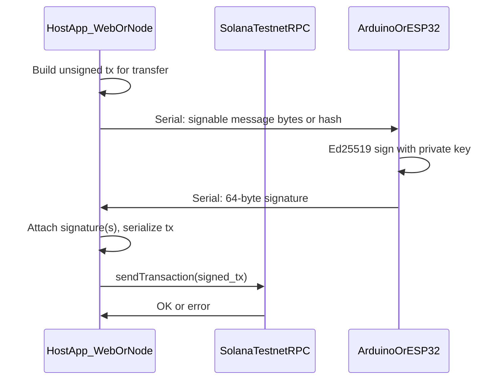

# Solana + Arduino “hardware wallet” feasibility and first steps

## How testnet “sees” your wallet (it does not see USB)

- **The Solana network does not discover or enumerate USB devices.** Validators and RPC nodes accept **signed transactions** via JSON-RPC (HTTP or WebSocket). There is no wallet plug-in protocol at the chain layer comparable to “the testnet detects my Ledger.”
- **Your computer is the only thing that talks to testnet.** Flow that works for hackathons and matches how real hardware wallets integrate with apps:



- **Implication:** “Making testnet understand USB” is the wrong mental model. You make **your dashboard app** understand serial/USB: it is the **signing oracle** bridge, then you broadcast like any other wallet.

## Is passing “all of Solana” through the Arduino feasible?

- **Not full node, not full transaction building on-device (for a 36h demo).** The MCU should do **one job well**: protect/use a private key and **sign** the exact payload your host asks it to sign (with user confirmation on a button).
- **What must run on the host:** transaction construction, recent blockhash fetch, fee computation, serialization to the form Solana expects for signing, RPC `sendTransaction`, confirmations, your “ledger network UI,” AI chat, Capital One mock data ([Nessie](https://api.nessieisreal.com)), etc.
- **What must run on the device:** store (or derive) a keypair, show minimal trust UI (OLED optional), **Ed25519 sign** the message the host sends, optional physical confirm button.
- **Chip choice:** Prefer **ESP32** (or another 32-bit MCU with enough flash/RAM) for Ed25519 and a reasonable UX. Classic 8-bit Arduino is possible but painful for crypto + protocol; if you only have Uno-class boards, scope down to “one secure signer + one display” or use ESP32 for both “ledgers.”

## Security (set expectations for judges)

- DIY devices lack a **secure element**; keys can be extracted with physical access and sufficient effort. For Bitcamp, position this as **education + prototype**, use **testnet SOL only**, and emphasize threat model in README/judging.

## Fitting sponsor angles (without derailing the core demo)

- **Solana (MLH):** Clear use of testnet, transactions, and wallet-like signing story.
- **Cipher (digital forensics):** Frame the UI as **audit / investigation** of flows: transaction graphs, memo inspection, export of “case” artifacts, or detection-style analytics over **your own** demo traffic—stay ethical and on-testnet.
- **Capital One:** Parallel “fiat” or financial literacy layer using Nessie mock accounts alongside crypto (dashboard unification story).
- **Hardware prize / “Most LIT”:** Buttons + LED strips (screens excluded from LED count per their rules) as status/signing indicators.

## Expanded implementation steps

### Part A — Next.js app + Solana (`@solana/web3.js`)

1. **Scaffold**
   - `create-next-app` (App Router, TypeScript). Add `@solana/web3.js` (this is the usual JS “Solana SDK” for apps; you do not need a separate package name beyond that for basic transfers).

2. **Where code runs (important for keys)**
   - **Never put raw private keys in client-side React** (they would ship to the browser). For a hackathon MVP with two fixed “ledger” identities, store secrets **only** on the server:
     - Environment variables in `.env.local` (e.g. base58-encoded secret keys), read inside **Route Handlers** (`app/api/.../route.ts`) or Server Actions.
   - Flow: UI button → `POST /api/transfer` → server loads keypair from env → builds tx → signs → `sendTransaction`. Later, replace `Keypair.sign` with “get signature from serial bridge” while still keeping secrets off the client.

3. **Point at testnet**
   - `new Connection("https://api.testnet.solana.com", "confirmed")` (or another public testnet RPC; have a backup URL if rate-limited).

### Part B — Getting two test “addresses” (keypairs)

Addresses on Solana **are** base58-encoded **public keys** from Ed25519 keypairs.

1. **Generate two keypairs (one-time script or REPL)**

   ```ts
   import { Keypair } from "@solana/web3.js";
   import bs58 from "bs58";

   const a = Keypair.generate();
   const b = Keypair.generate();

   console.log("Address A:", a.publicKey.toBase58());
   console.log("Secret A (base58, SERVER ONLY):", bs58.encode(a.secretKey));

   console.log("Address B:", b.publicKey.toBase58());
   console.log("Secret B (base58, SERVER ONLY):", bs58.encode(b.secretKey));
   ```

2. **Persist for the app**
   - Put `SOLANA_WALLET_A_SECRET` and `SOLANA_WALLET_B_SECRET` (base58) and optionally the public addresses in `.env.local` for your API routes to reconstruct:

   ```ts
   Keypair.fromSecretKey(bs58.decode(process.env.SOLANA_WALLET_A_SECRET!));
   ```

3. **Fund them with test SOL (faucet)**
   - Open [Solana faucet](https://faucet.solana.com/) (or your RPC provider’s faucet), paste **public** address A, request airdrop; repeat for B.
   - Alternatively call `connection.requestAirdrop(pubkey, lamports)` from a **server-only** script once, respecting rate limits.
   - Confirm balances in UI with `connection.getBalance(pubkey)` or Solana Explorer (testnet).

4. **First working transfer (software signing)**
   - Server: `getLatestBlockhash`, build `Transaction` with `SystemProgram.transfer({ fromPubkey, toPubkey, lamports })`, **partialSign** or sign with sender keypair, `sendRawTransaction`, `confirmTransaction`.
   - You now have two addresses and a proven pipeline before hardware.

### Part C — “Making your own Ledgers” with Arduinos (architecture)

**What a DIY ledger is in this project:** a microcontroller that holds **one** Ed25519 private key and can **sign a blob of bytes** your Next.js app gives it—**not** a device that speaks Solana RPC.

**Recommended hardware:** two **ESP32** boards (or SAMD21-class) + USB serial; 8-bit AVR is a last resort for Ed25519 + UX.

**Firmware responsibilities**

1. On first boot (dev): generate or receive a keypair; store **secret key** in NVS/flash (hackathon: acceptable short-term; document risk).
2. Expose **public key** to host (print once over serial or show on OLED) so the app knows the on-chain address to fund and use as `from`/`to`.
3. Wait for serial command: “sign this message” (raw bytes Solana expects signed for the fee payer).
4. Optional: physical **confirm button** gates signing (good for demo).
5. Return **64-byte Ed25519 signature** over serial.

**Host responsibilities (unchanged)**

- Build unsigned Solana transaction, serialize the **signable message** per Solana rules (`Transaction` / `VersionedTransaction` message bytes).
- Send those bytes to the correct MCU; receive signature; attach with `addSignature` / equivalent; broadcast via RPC.

### Part D — Connecting Next.js to USB serial (choose one)

Browsers cannot see COM ports without **Web Serial** (Chrome/Edge), and Node in API routes often should not hold long-lived serial handles across serverless invocations. Pick one pattern:

| Approach | Pros | Cons |
| -------- | ---- | ---- |
| **A. Web Serial in the browser** | No separate binary; UI talks to ESP32 via Chrome | User gesture to select port; only Chromium; must run signing in client **or** send bytes to server after (careful with keys) |
| **B. Small local Node “bridge”** (`serialport` package) | Reliable on Windows; can expose `http://localhost:3456/sign` | User runs two processes: `next dev` + `node bridge.js` |
| **C. Next.js API + serial only in long-running Node** | Single command if you use a custom server | More setup |

**Practical hackathon path:** use **B** for the demo: a tiny Node script lists COM ports, reads sign request from your app, talks to Arduino, returns signature; Next.js calls `localhost` during the demo. Optionally add Web Serial later for a single-binary story.

### Part E — Building the two “ledgers” end-to-end

1. **Flash firmware A and B** with different keypairs; label boards. Record each **public** address; fund both from faucet.
2. **Software test:** For ledger A’s pubkey, verify the host can build a transfer **to** B’s address and that signing with the **same** secret in software matches what the MCU must produce (compare signatures against `nacl.sign.detached` / `@solana/web3.js` helpers for the same message bytes).
3. **Hardware swap:** Replace software `sign` with serial `sign` from device A only.
4. **Ping-pong demo:** Transfer A→B (device A signs), then B→A (device B signs). Only the **sender** must sign a simple system transfer.

## First step (do this in order) — summary

1. **Software-only E2E on testnet (no Arduino yet)**
    - Create two keypairs, request test SOL from a **faucet** (official or community; may require captcha or devnet if testnet is flaky—have a fallback).
    - Use `@solana/web3.js` (or Solana CLI) to build and submit a **SystemProgram.transfer** between the two addresses and confirm it landed.
    - This proves RPC, fees, blockhash, and serialization are correct before any serial protocol exists.

2. **Define the signing contract**
    - Replicate exactly what your JS client will sign: for legacy transactions, the **serialized message** that `Transaction` signs; for **VersionedTransaction**, the **message bytes** per Solana’s signing rules.
    - Your host prints hex of the signable payload and verifies a known-good signature with the same keypair in software before involving hardware.

3. **Replace `Keypair.sign` with serial**
    - Implement: host sends signable bytes → MCU returns 64-byte Ed25519 signature → host attaches to transaction and submits.
    - Start with **one** device as signer; add the second device as the counterparty address only (no need for both to sign a simple transfer).

4. **Only then** add the “two Arduinos send money back and forth” demo choreography (alternate which device signs, same on-chain mechanics).

## Practical pitfall to plan for

- **Transaction size and blockhash:** Signing must happen quickly enough that the blockhash is still valid when you submit; if the user is slow on hardware, refresh blockhash and rebuild before signing.
- **Windows COM ports:** Install USB-UART drivers if needed; identify the correct COM port for each board in Device Manager before wiring the bridge.

## Repo note

Your [`cryptX`](c:\Users\nanna\Desktop\Coding Projects\cryptX) folder can host a Next.js app plus a `firmware/` (Arduino/ESP-IDF) and optional `serial-bridge/` Node script. Implementation starts with Part B (two funded addresses + server-side transfer), then Part D–E (serial + MCU signing).
